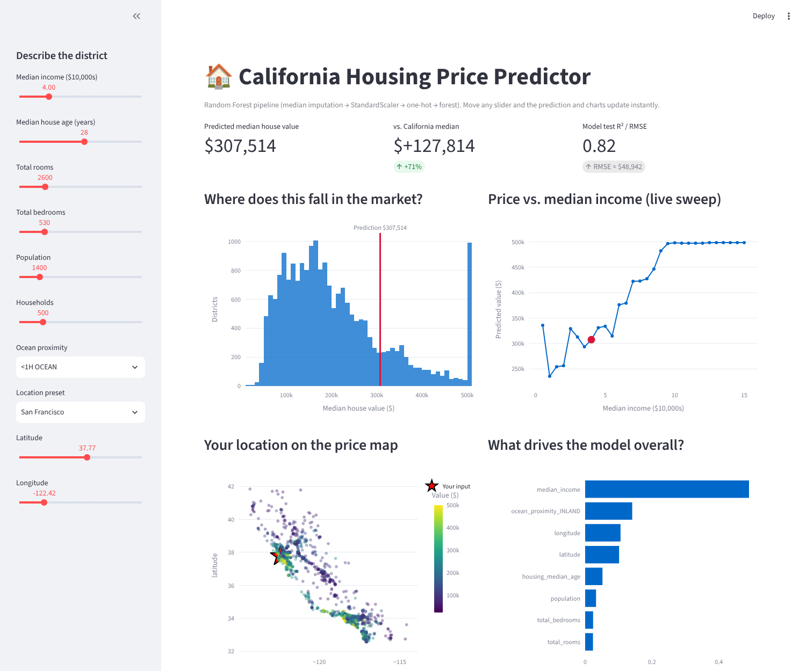
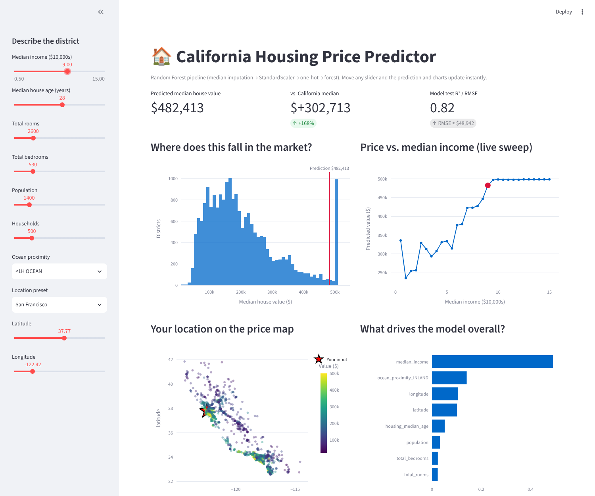

# Task 5 — Interactive AI Dashboard (Streamlit)

A **Streamlit** app around the Task 6 housing-price model. The user describes a California district in the sidebar
(income, house age, rooms, population, ocean proximity, location…) and the dashboard **re-predicts and redraws every
chart in real time**.

## Run it

```bash
cd task_05_interactive_dashboard
pip install -r requirements.txt
streamlit run app.py
```

It opens at http://localhost:8501.

## What you see

- **Live prediction** with a comparison to the California median price and the model's test R² / RMSE.
- **Market position** — histogram of all districts with your prediction marked.
- **Live income sweep** — the model re-run across 30 income values while holding your other inputs fixed.
- **Location map** — your point (red star) on a map of sampled districts coloured by price.
- **Feature importance** — what drives the model overall.
- A warning when the prediction approaches the dataset's $500,001 price cap.

## Screenshots

Default inputs (income 4.0 → predicted ≈ $307k):



After moving the income slider to 9.0 (prediction rises to ≈ $482k; the markers on every chart move with it):



## Files
- `app.py` — the Streamlit app
- Loads the trained pipeline and `housing.csv` from `../task_06_housing_price_predictor/` (one shared copy; run Task 6 first if the model file is missing)
