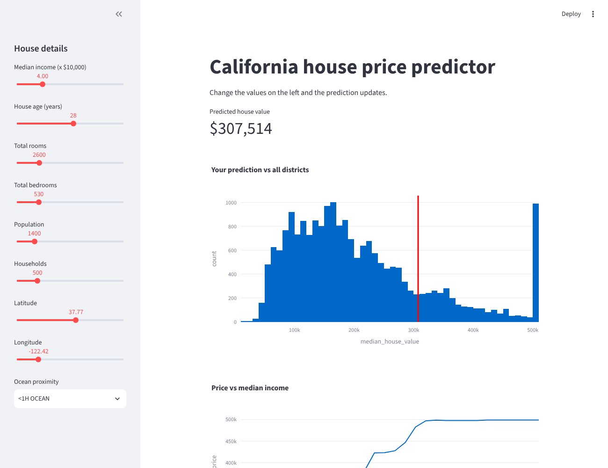
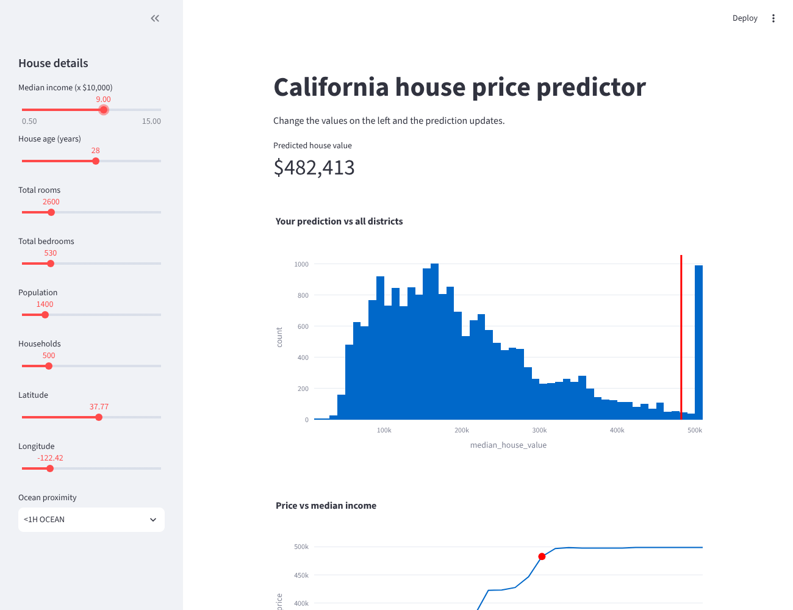

# Task 5: Interactive dashboard (Streamlit)

A small Streamlit app that uses the housing model from task 6. You change the house details in the sidebar and the predicted price and both charts update right away.

## How to run

```
cd task_05_interactive_dashboard
pip install -r requirements.txt
streamlit run app.py
```

It opens at http://localhost:8501

## What it shows

- the predicted price
- a histogram of all districts with a red line at the predicted price
- a line chart of how the price changes with income (other inputs stay the same)

## Screenshots

Default values (income 4.0):



After moving the income slider to 9.0 the price goes up to $482k:


